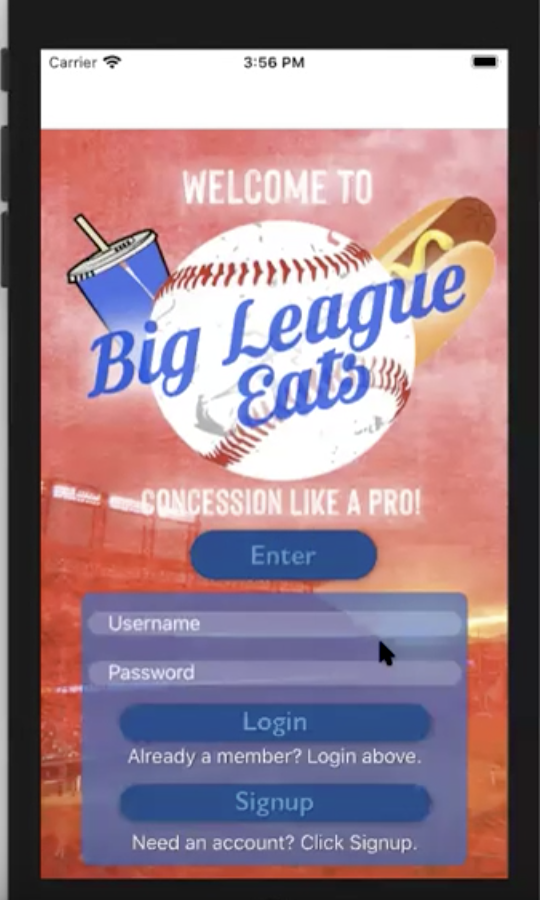
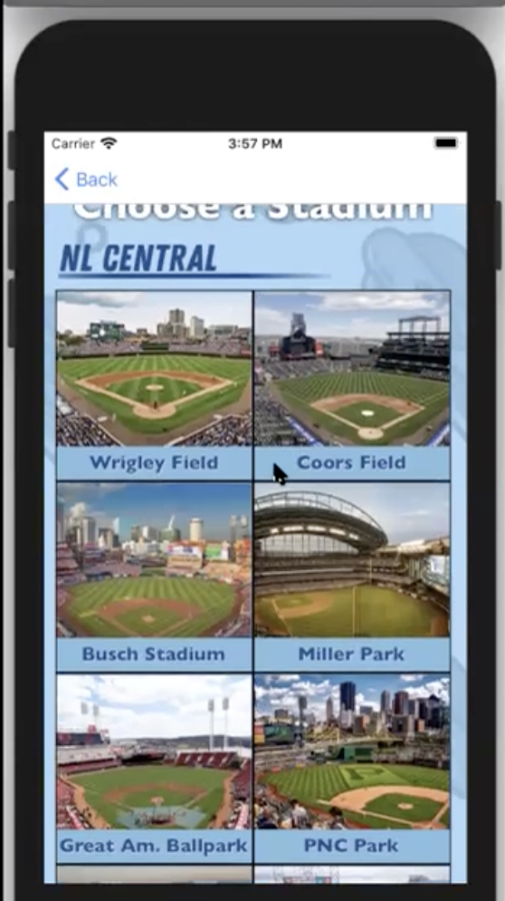
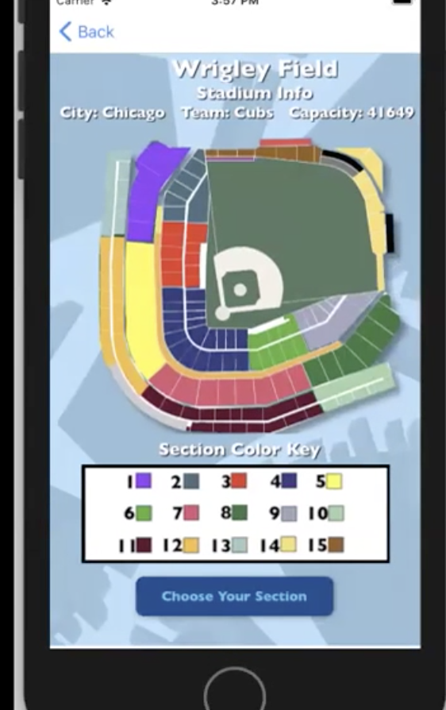
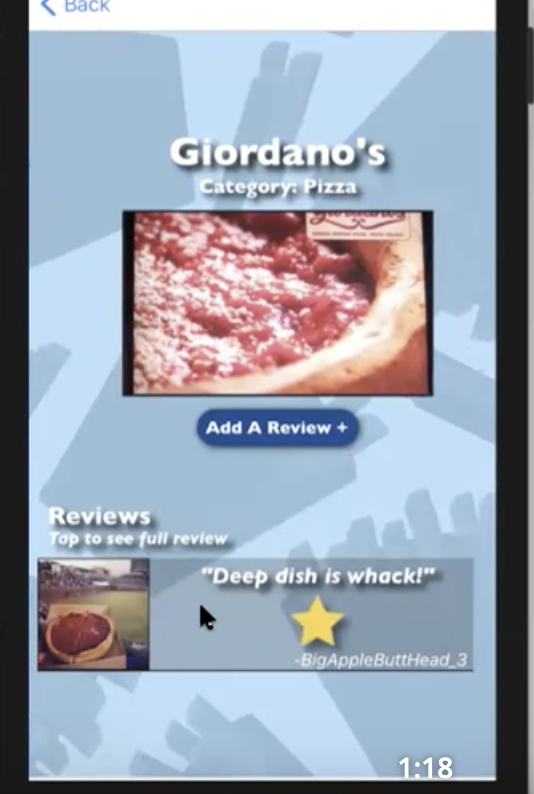
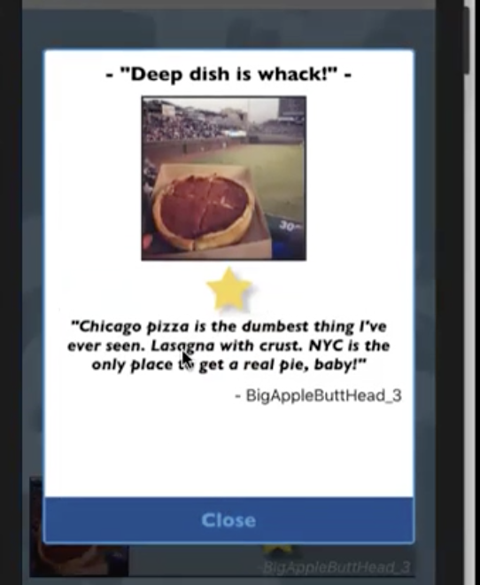
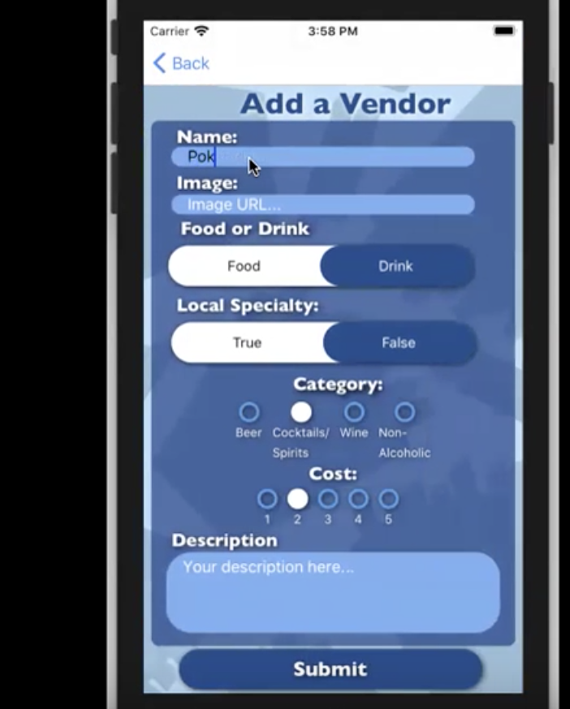

# Big League Eats 

### The app that lets you concession like a pro

## Description
* Users can find concession stands near their seats and major league ballparks
* Users select their stadium and seating section to see nearby concessions
* Users can leave reviews for existing concessions
* Users can add new concessions to the different seating ssections

## Setup
* Clone down this repo
* Clone down rails backend <a href="https://github.com/dfert1987/BigLeagueEats-Backend">HERE</a>
* Open rails backend by typing 'rails s' into termninal
* Expo is required to open frontend. If expo is installed use 'expo start' to open frontend.

## Demo 

### Watch demo below

<a href="https://streamable.com/ynic05"> CLICK HERE TO WATCH!</a>

## Walkthrough

### Choose a Stadium

* Choose the Stadium you are at (Currently only Wrigley Field is up and working for presentation purposes)
* Stadium cards organized by division

### Choose Section

* Choose the section you are sitting in
* Based off color coded stadium map

### Section Page

 
* View all reviewed food/drink vendors near you
* See average star rating and price
* Can choose to add a new vendor

### Vendor Page

* Can see all previous reviews of a vendor
* Pop-up modal allows you to read full review
* Can leave your own review (functionality still not fully available)

### Add a Vendor

* Fill out form to add a new vendor
* Choose an image thumbnail, and leave a short description (not a review)

## Notes

* This is still a work in progress
* Only one stadium map is hard coded in (Wrigley Field)
* User review form is not completed
* Login/Signup is currently only a dummy version. Proper auth yet to be coded. 

